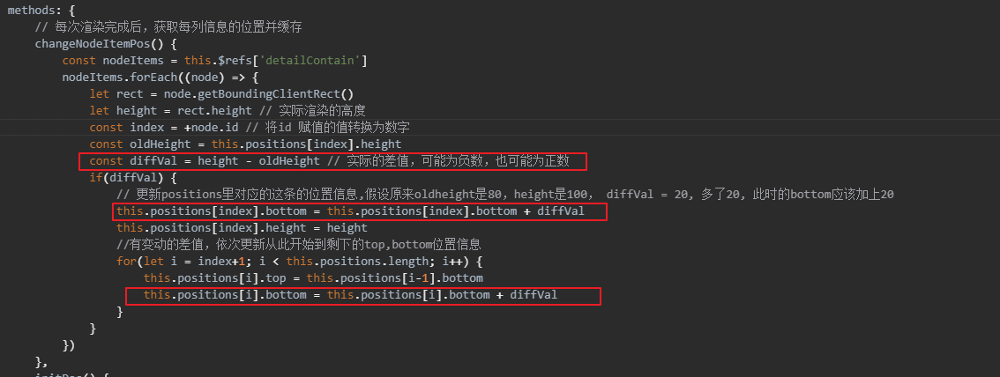
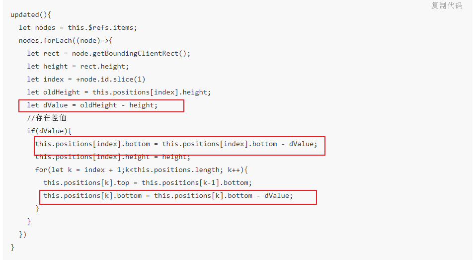

<font color=blue size=6>虚拟列表(item高度不固定实现+理解)</font>


与之前的一样，还是看这篇文章，带你入门

传送门： [「前端进阶」高性能渲染十万条数据(虚拟列表)](https://juejin.cn/post/6844903982742110216)


自己实现的代码，戳这篇链接：[js虚拟列表实践（item的高度是不固定的）](https://jsrun.net/gyeKp/edit)
###### <font color=red size=2>重要提示： 一定要充分理解上面教程的思想，再结合我的文章一些理解</font>

高度不固定的时候，这几个函数特别重要，一定要仔细看

#### 第一个： updated里的对于 每个item高度变化的操作

```js
updated() {
    // ...
    this.changeNodeItemPos()
    // ...
},
methods: {
    // 每次渲染完成后，获取每列信息的位置并缓存
    changeNodeItemPos(){
        const nodeItems = this.$refs['detailContain']
        nodeItems.forEach((node) => {
            let rect = node.getBoundingClientRect()
            let height = rect.height // 实际渲染的高度
            const index = +node.id // 将id 赋值的值转换为数字
            const oldHeight = this.positions[index].height
            const diffVal = height - oldHeight // 实际的差值，可能为负数，也可能为正数
            if (diffVal) {
                // 更新positions里对应的这条的位置信息,假设原来oldheight是80，height是100， diffVal = 20, 多了20, 此时的bottom应该加上20
                this.positions[index].bottom = this.positions[index].bottom + diffVal
                this.positions[index].height = height
                //有变动的差值，依次更新从此开始到剩下的top,bottom位置信息
                for (let i = index + 1; i < this.positions.length; i++) {
                    this.positions[i].top = this.positions[i - 1].bottom
                    this.positions[i].bottom = this.positions[i].bottom + diffVal
                }
            }
        })
    }
}
```

**注意这里： 我的diffVal是height - oldHeight;而教程里的 diffVal = oldHeight - height;**

* 如果diffVal是height - oldHeight，要注意下面的值



* 如果diffVal是oldHeight - height，要注意下面的值



#### 第2个，滚动后将偏移量的获取方式变更：

```js
scrollEvent() {
  //...省略
  if(this.start >= 1){
    this.startOffset = this.positions[this.start - 1].bottom
  }else{
    this.startOffset = 0;
  }
}
```

#### 第3个，使用二分查找法来降低检索次数，用于查找列表的起始索引
#### 第4个，使用缓冲区优化的，我没有再细看，不过也是需要关注的点哦~

<Valine />
