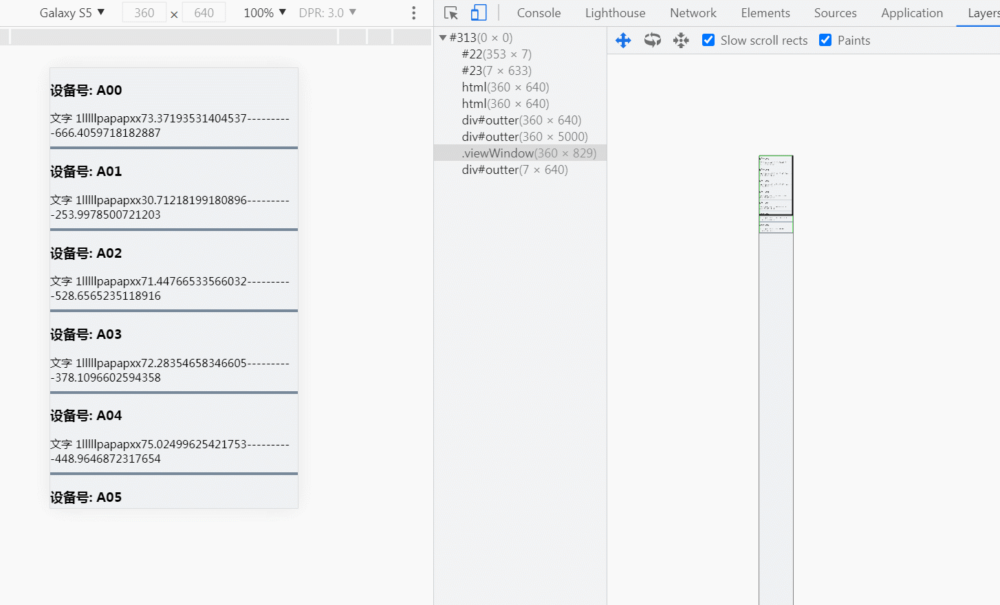

<font color=blue size=6>虚拟列表(item固定高度实现+理解)</font>

* 产生原因：

  由于一次性渲染大数据，dom开销过大而提出来的一种优化方案

* 概述：

  虚拟列表其实是按需显示的一种实现，即只对可见区域进行渲染，对非可见区域中的数据不渲染或部分渲染的技术，从而达到极高的渲染性能。

掘金上的这篇文章讲的太好了，生动形象，很有利于初学者理解！ 传送门： [「前端进阶」高性能渲染十万条数据(虚拟列表)](https://juejin.cn/post/6844903982742110216)

>强烈推荐阅读并跟着代码实操， 毕竟渣渣的我之前也不理会这个思想，后来跟着学习，慢慢领悟的感觉太棒了。


1、每个元素的高度是固定的 虚拟列表滚动

跟着文章的教程走就可以实现，重点是领会思想。自己实现的代码，戳这篇链接：[js虚拟列表实践-item高度固定](https://jsrun.net/8heKp)
###### <font color=red size=2>重要提示： 一定要充分理解上面教程的思想，再结合我的文章一些理解</font>

在教程文章里，当item高度是固定时，看的时候有2个地方不明白，看了评论+自己的理解，有些明白了，如果你是跟我有一样疑惑的，接着往下看吧：

#### 第一个问题：

>文章中有提到：当滚动后，由于渲染区域相对于可视区域已经发生了偏移，此时我需要获取一个偏移量startOffset，通过样式控制将渲染区域偏移至可视区域中。 
> 偏移量startOffset = scrollTop - (scrollTop % itemSize)

解答：

为啥要设置成这样的，我后来思考了下，在这里举例说明一下：

* 比如现在每个item的固定高度是50，现在滚动了scrollTop是120， 120/50= 2.4， 那其实滚动上去2个item的长度=100就好，第三个item还是可见的，

那我们按照这个公式算一下 ，偏移量startOffset = 120 - (120 % 50) = 120 - 20 = 100

* 再比如，现在滚动了scrollTop是170， 170/50= 3.4， 那其实滚动上去3个item的长度=150就好，多出来的那个在可视区域还是可见的。

那我们按照这个公式算一下 ，偏移量startOffset = 170 - (170 % 50) = 170 - 20 = 150

即刚好验证了评论里所说的一条：


是不是正正好！不得不说 这个公式秒啊！

#### 第二个问题：为什么要为 infinite-list(为列表项的渲染区域), 这个在滚动渲染的时候，要加上style 值为 :style="{ transform: getTransform }" ？

```js
computed:{
    //...
    //偏移量对应的style
    getTransform(){
      return `translate3d(0,${this.startOffset}px,0)`;
    },
    // ...
  },
```

解答：评论区也有给我一样困惑的人，哈哈，先看看是怎么解答的吧


这个评论已经解释的听清楚的了，我们通过chrome里的Layers渲染看一下是怎么回事



实际上最长的底部的那个灰色的，是整个数据的高度。而我们在滚动的时候，其实能看到的视口就只有那么大。每次向上滚动的时候，
如果不加上 translate3d在y轴上的偏移量，数据会消失在滚动区域。

简言之，底部是一个大的轨道，当滚动时，轨道向上走，可视区域由于translate3d的作用，看起来就像是 始终保持在当前，只是里面的数据替换成对应应该显示的数据


<Valine />

