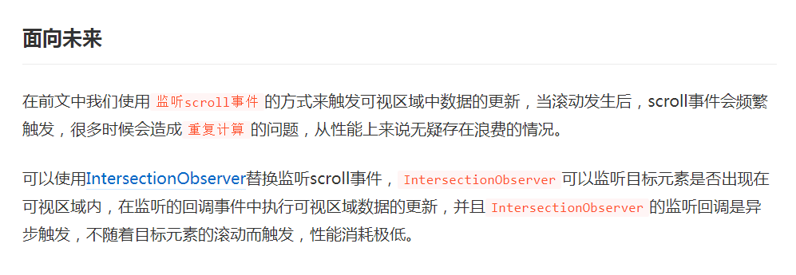

<font color=blue size=6>虚拟列表(item 固定高度--采用intersectionObserver)(一)</font>

> 之前掘金的那篇虚拟列表教程文章中，在面向未来时这样提到：可以用IntersectionObserver来实现，消耗的性能极低



**IntersectionObserver？？**


这是个啥东西，为了写这个系列文章，哈哈，也为了丰富我的思维，开始探索+实现吧！

首先是了解IntersectionObserver是啥，网上讲解的很多，随便搜索一大把。我这里也就不展开篇幅了，这里我推荐我看的2篇文章吧（ps:看完再继续往下看哦）

 * [IntersectionObserver MDN传送门](https://developer.mozilla.org/zh-CN/docs/Web/API/IntersectionObserver)
 * [谈谈IntersectionObserver懒加载](https://www.jianshu.com/p/84a86e41eb2b)

利用空闲时间搜索+查阅，参考阅读相关代码，干了几天，实现出来咯！下面开始吧

#### 这里参考的了掘金上的这篇文章：
* 网易云音乐的技术团队分享的：[一个简洁、有趣的无限下拉方案](https://juejin.cn/post/6844904009568878600)
* 上述对应的github地址: https://github.com/Guohjia/listScroll


不得不说，阅读完源码给了我好大的启发！卡壳的部分，也随着阅读源码中，不再纠结了

#### transform translate3d 方案实现
基本了解 Intersection Observer 之后，接下来就看下如何用 Intersection Observer + padding 来实现无限下拉。
先概览下总体思路：

* 监听一个固定长度列表的首尾元素是否进入视窗；
* 更新当前页面内渲染的第一个元素对应的序号；
* 根据上述序号，获取目标数据元素，列表内容重新渲染成对应内容；
* 可视区域容器 translate3d调整y轴，即竖直方向的startOffset值，模拟滚动实现（与之前的我写的 [虚拟列表(item固定高度实现+理解)](/front/study/virtualList-fixedItem) 
* html与之前基本一致（去除了@scroll方法）、css是一致的，js做了相关改动

**核心：利用可视区域容器 translate3d调整y轴值(startOffset) ,随着无限下拉而本该有的、越来越多的 DOM 元素，仅仅保留视窗区域上下一定数量的 DOM 元素来进行数据渲染**


### 1、html部分
```html
<div id="app" style="height: 100%">
    <!-- 最外层的容器，会有滚动条出现 -->
    <div ref="outter" id="outter" >
        <!--总容器的高度（比如100个元素每个高度100，这个高度就是10000），设置了position: absolute;z-index:-1等样式，不可见，为了让外层出现滚动条-->
        <div class="allListWrapper" refs="allListWrapper" :style="{ height: listHeight + 'px'}"></div>
        <!--可视区域-->
            <div class="viewWindow" :style="{ transform: getTransform }">
                <div class="detailContain" ref="detailContain" v-for="(item,index) in visibleData" :key="index" :id="index">
                        <h3>设备号: {{item.name}}</h3>
                        <div class="text">
                            <span >文字</span>
                            <span >{{item.text}}</span>
                        </div>
                    </div>
                </div>
            </div>
    </div>
</div>
```

### 2、css部分
```css
body,
html {
  height: 100%;
}

body {
  margin: 0;
}

#outter {
  background: #EFF1F3;
  height: 100%;
  overflow: auto;
  position: relative;
  -webkit-overflow-scrolling: touch;
}

.allListWrapper {
  position: absolute;
  left: 0;
  top: 0;
  right: 0;
  z-index: -1;
}

.viewWindow {
  position: absolute;
  left: 0;
  top: 0;
  right: 0;
  overflow: hidden;
}

.detailContain {
    border-bottom: 4px solid lightslategray;
    padding-bottom: 10px;
}
```
    
### 3、重点是js的实现部分

先看下基础的实现

```js
var app = new Vue({
    el: '#app',
    data: {
        tableAllData: [],
        // 起始索引
        start: 0,
        // 结束索引
        end: -1,
        // 起始偏移量    
        startOffset: 0,
        screenHeight: 0,
        itemSize: 100,
        // 改动！！以下为多增加的几个参数
        server: null,
        domCatheObj: {
            currentStart: 0, // 当前开始的索引
            // 对于回滚回来
            topReturnPrevY: 0,
            topReturnPrevRatio: 0,
            // 对于滚下去
            bottomToTopPrevY: 0,
            bottomToTopPrevRatio: 0,
        }
    },
    computed: {
        // 列表的总高度
        listHeight() {
            // 101为每个的size
            return this.tableAllData.length * this.itemSize
        },
        // 可显示的列表项数 = Math.ceil(screenHeight / itemSize) * 2，
        // 改动！！ 这里若不设为2倍的项数，在滚动的时候会不正常，也没找到啥原因...
        visibleCount() {
            const value = Math.ceil(this.screenHeight / this.itemSize)
            return value * 2
        },
        // 获取实际应该显示在列表里的
        visibleData() {
            return this.tableAllData.slice(this.start, Math.min(this.end, this.tableAllData.length))
        },
        getTransform() {
            return `translate3d(0,${this.startOffset}px,0)`;
        }
    },
    methods: {
        //...未展示出来
        initObserve() {
            // ??
        }
    },
    mounted() {
        this.screenHeight = document.body.clientHeight
        for (let i = 0; i < 50; i++) {
            this.tableAllData.push({
                name: 'A0' + i,
                alreadySum: 2 * Math.random(),
                text: '1lllllpapapxx' + Math.random() * 100 + '----------' + Math.random() * 1000,
            })
        }
        this.start = 0;
        this.end = this.start + this.visibleCount
        
        // 改动！！初始化监听一个固定长度列表的首尾元素是否进入视窗
        this.$nextTick(() => {
            this.initObserve()
        })
    }
})
```

### 3.1 initObserve方法的实现

> initObserve方法里做了2件事，

> 第一件： 监听一个固定长度列表的首尾元素是否进入视窗，若首元素、尾元素进入视窗，该采取什么不同的的方法？

> 第二件： 为这个固定长度列表的首尾元素加上特殊的class标识，由于html没有做区分

代码实现：

```js
initObserve() {
    let that = this;
    const config = {
        root: null,
        rootMargin: '0px',
    };

    // 观察元素开始进入视窗或者完全离开视窗的时候都会触发
    this.server = new IntersectionObserver(function (entries) {
        console.log('entries --', entries)
        entries.forEach(entry => {
            const {target} = entry;
            if (target.classList.contains('first')) {
                that.topItem(entry)
            } else if (target.classList.contains('last')) {
                that.bottomItem(entry)
            }
        })
    }, config)

    this.observeEle();

},
query(selector) {
    return Array.from(document.querySelectorAll(selector));
},
setClass() {
    const ele = this.query('.detailContain')
    const firstEle = ele[0]
    firstEle.classList.add('first')

    // 监听最后一个元素
    const lastEle = ele[ele.length - 1]
    lastEle.classList.add('last')

    return { firstEle, lastEle }
},
// 首尾元素加上对应的class做区分
observeEle() {
    const { firstEle, lastEle } = this.setClass()
    // 监听第一个元素
    this.server.observe(firstEle)
    // 监听最后一个元素
    this.server.observe(lastEle)
},
topItem(entry) {

},
bottomItem(entry) {

}
```

### 3.2 bottomItem的实现

> 此方法是向下滚动，加载更多的内容。要明确做哪几件事:

> 1、尾元素出现时，说明我们需要加载更多的元素了，此时的start 初始索引、 end 结束索引改如何变化？

举个例子来说明：

* 最开始渲染的是 数组中序号为0~14的元素，即此时对应的 start 为 0；
* 当序号为 14 的元素（即上一步的 lastItem ）进入视窗时，我们就会往后渲染设置计算好的 increment 个元素，即渲染序号为 14 ~ (14 + increment) 的元素，那么此时的 start 为 14, end = start + visibleCount；
* 以此类推。。

所以这部分形容的代码如下：

```js
getStartIndex(isScrollDown) {
    // 缓存之前的start 索引
    const {currentStart} = this.domCatheObj
    let start;

    // 以展示数量的一半作为增量
    const increment = Math.floor(this.visibleCount / 2)

    if (isScrollDown) {// 向下滚动，
        start = currentStart + increment
    } else { // 向上回滚
        start = currentStart - increment
    }

    if (start < 0) {
        start = 0
    }

    return start;
},
```

> 2、向下滚动时，当start、end索引改变时，我们该做些什么？

* 记录下此时的start, 以便后续的向下加载更多滚动

* 想象一下，页面本来有15个元素，又新加了15个元素。按道理，这15个新加的元素排在后面，但想看见新加的元素咋办呢？将容器的滚动轴 通过 translate3d y轴的距离，移动到当前新加的元素开头，新加的这些元素在当前视口显示

* translate3d y轴的距离 怎么计算呢？ 因为我们向下滚动的时候，是以 展示数量的一半作为增量increment，进行start变化的，则滚动的距离： this.startOffset += this.itemSize * increment

* 同时，我们应该缓存 记录下此时的尾元素距顶部的距离、尾元素显示的intersectionRatio，为了之后加载更多进行的比较


上述代码如下书写：

```js
 // 向下滚动，内容加载更多,
bottomItem(entry) {
    const {boundingClientRect} = entry
    const {top} = boundingClientRect
    const { bottomToTopPrevY, bottomToTopPrevRatio} = this.domCatheObj
    
    // 向下滚动，最后一个元素的top 距离顶部的距离变得越来越小
    // 用来精确判断是向下滚动
    if(top < bottomToTopPrevY && entry.isIntersecting && entry.intersectionRatio >= bottomToTopPrevRatio) {
        console.log('go bottom ...')
        this.start = this.getStartIndex(true)
        this.end = this.start + this.visibleCount
        
        //设置滚动的 translate3d y轴距离: startOffset
        this.setScrollDownStartOffset()
        
        // 注意：这里需要重新设置start、end的类名！！
        this.$nextTick(() => {
            this.setClass()
        })

        // 缓存当前的start、此时的尾元素距顶部的距离、尾元素显示的intersectionRatio 参数
        this.updateDomCatheObj({
            currentStart: this.start,
            bottomToTopPrevY: top,
            bottomToTopPrevRatio: entry.intersectionRatio
        })
    }else {
        this.updateDomCatheObj({
            bottomToTopPrevY: top,
            bottomToTopPrevRatio: entry.intersectionRatio
        })
    }
},
updateDomCatheObj(obj) {
    Object.assign(this.domCatheObj, obj)
},
setScrollDownStartOffset() {
    // 以展示数量的一半作为增量
    const increment = Math.floor(this.visibleCount / 2)
    
    this.startOffset += increment * this.itemSize
}
```

> 3、里面有个注意代码看见了么，我来解释下是啥意思

```js
this.$nextTick(() => {
    this.setClass()
})
```

当时测试demo发现，页面滚动到底部，再滚回去，再向下加载更多竟然不触发该方法了，调试一波发现：

当前mock数据量是50个， visibleCount在chrome 手机模拟下是14个

| 次数 | 渲染 | 参数 |
| :----:| :----: | :----: |
| 1 | 序号0-13的元素 | start = 0, end = 13 |
| 2 | 序号7-21的元素 | start = 0 + 7(增量) = 7, end = 7 + 14 = 21 |
| 3 | 序号14-28的元素 | start = 7 + 7(增量) = 14, end = 14 + 14 = 28 |
| 4 | 序号21-35的元素 | start = 14 + 7(增量) = 21, end = 21 + 14 = 35 |
| 5 | 序号28-42的元素 | start = 21 + 7(增量) = 28, end = 28 + 14 = 42 |
| 6 | 序号35-49的元素 | start = 28 + 7(增量) = 35, end = 35 + 14 = 49 |
| 最后一次 | 序号42-50的元素 | start = 35 + 7(增量) = 42, end = 42 + 14 = 56， 最终会取总数50作为end的 |


即最开始mounted的时候，页面最后一个元素加上class的索引是13，但是滚动到最后时，该显示的数量不足visibleCount=14个，
所以对应的last没有被替换显示出来。

上述代码就是手动再为最后一个元素加上class


完整代码请戳：[完整代码](https://jsrun.net/MxeKp)


<Valine />
