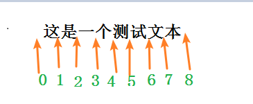

<font color=blue size=6>六期模块--计算公式功能点梳理</font>

### （一） 梳理问题 + 知识点补充篇

1、src/views/standardRuleMaintain下的 divEditable.vue

> 可编辑的div, 设置属性是**contenteditable**，就可以让其展示为输入框的效果

2、计算公式维护这边主要涉及了几个问题（重点问题加粗标出了）

 * **如何确定当前的光标位置，可以支持键盘输入@显示，也支持选择后插入**？
 * **选择的是变量，如何显示为蓝色，且光标不可定位在其中** ？
 * **如何与后台交互这部分数据，并回显数据** ？
 * 如何输入@后显示配置的下拉列表，并且支持模糊搜索？
 * 如何回车后也支持上述功能实现（之前是不支持的...）?


知识点涉及:
>window.getSelection()、range 属性及其方法

>正则匹配及替换


### 什么是selection, 里面包含什么？

 selection相关知识点: [MDN selection](https://developer.mozilla.org/zh-CN/docs/Web/API/Selection)

 window.getSelection() 方法表示用户选择的文本范围或光标的当前位置。

 动图了解：
 


重点了解这么几个知识：


用户可能从左到右（与文档方向相同）选择文本或从右到左（与文档方向相反）选择文本，这样就会导致anchor和focus是不同的。

（1） selection属性，以下属性均为只读。

| 属性        | 释义    |
| --------   | -----:   
| anchorNode| 返回该选区起点所在的节点（Node）|
| anchorOffset | 选区起点在 anchorNode 中的位置偏移量 |
| focusNode | 返回该选区终点所在的节点 |
| focusOffset 返回一个数字，其表示的是选区终点在 focusNode 中的位置偏移量。 |
| isCollapsed | 返回一个布尔值，用于判断选区的起始点和终点是否在同一个位置 |
| rangeCount | 返回该选区所包含的连续范围的数量|


(2) selection 相关方法

| 方法        | 释义    |
| --------   | -----:   
| getRangeAt| 返回选区包含的指定区域（Range）的引用|
| collapse | 将当前的选区折叠为一个点 |
| extend | 将选区的焦点移动到一个特定的位置 |
| modify | 修改当前的选区 |
| collapseToStart | 将当前的选区折叠到起始点 |
| collapseToEnd | 将当前的选区折叠到最末尾的一个点|
| selectAllChildren | 将某一指定节点的子节点框入选区。 |
| addRange | 一个区域（Range）对象将被加入选区 |
| removeRange | 从选区中移除一个区域 |
| removeAllRanges | 将所有的区域都从选区中移除|
| deleteFromDocument | 从页面中删除选区中的内容|
| selectionLanguageChange | 当键盘的朝向发生改变后修改指针的Bidi优先级|
| toString | 返回当前选区的纯文本内容|
| containsNode | 判断某一个 Node 是否为当前选区的一部分|


getRangeAt方法有一个参数index，**代表该Range对象的序列号；从0开始** ,在所有的浏览器除了火狐浏览器，只使用0

`var range = document.getSelection().getRangeAt(index);`


我们下面写个例子：

```html
<div style="background-color: white;color: #111; height: 200px;width: 200px">
	<p>这是一个测试文本</p>
    <button onclick="getSelect()">选中上面内容后点我</button>
</div>
```

```js
function getSelect() {
 const sel = window.getSelection();
 console.log('selection', sel.toString())

 console.log(`你选取了第${sel.rangeCount}段内容`)
 const range = sel.getRangeAt(0);
 let str = "第" + (sel.rangeCount) + "段内容为：" + range
 console.log('str ==', str)
}
```

最终展示效果：


****

### 什么是range, 里面包含什么？


表示的是范围，指的是文档中连续的一部分。range的相关理解可以参考这篇文章，讲的很详细： [range 理解,需翻墙](!https://javascript.info/selection-range#range-selection-methods)

range的创建可以用3种方法：

* 可以用 Document 对象的 Document.createRange 方法创建 Range，此时这个range是空的
* 也可以用 Selection 对象的 getRangeAt 方法获取 Range
* 还可以通过 new Range() 来得到 Range。

（1） range属性，以下属性均为只读。

| 属性        | 释义    |
| --------   | -----:   
| startContainer| 返回包含 Range 开始的节点|
| endContainer | 返回包含 Range 终点的节点|
| startOffset        |返回一个表示 Range 起点在 startContainer 中的位置的数字，（1）如果startContainer是文本节点、注释节点或CDATA节点，则返回“起点”在startContainer中字符偏移量。（2）如果startContainer是元素节点，则返回“起点”在startContainer.childNodes中的次序 |
| endOffset |返回一个表示 Range 终点在 endContainer 中的位置的数字，**如果Range的父节点是Text类型的Node，则*偏移索引将是Range结束字符的索引*。对于其他Node类型，endOffset是子节点在父节点末尾的索引** |
| collapsed | 表示 Range 的起始位置和终止位置是否相同， true : 相同， false: 不同 |
| commonAncestorContainer | 返回完整包含 startContainer 和 endContainer 的、最深一级的节点|

前面得到例子里，我们打印以下获取到的range对象里：

<font color=red>注意endOffset的值：因为该节点是textNode，所以这里是第4个字符，索引是4！</font>


理解为：




接下来，我们看一下，startContainer、endContainer分别是文本节点或者 包含节点的节点时，会有啥不同？

**注：这里获取： [示例代码](https://jsrun.net/QTQKp/edit),**

* 为文本节点，则offset偏移量就是字符的偏移量

```html
<div id="singleRow">我是单独的一行文本</div>
<button onclick="selPart()">选中部分文字</button>
```

```js

// 选中部分文字
function selPart() {
 const range = new Range();
 const el = document.getElementById('singleRow');
 range.setStart(el.firstChild, 2);
 range.setEnd(el.firstChild, 5);
 console.log('此时Range是',range.toString()) // 打印出： 此时Range是 单独的
}
```

**这里，用el.firstChild是为了找出里面具体文字的各个位置**


* 为node节点，且节点里包含其他node节点，则endOffset是子节点在父节点末尾的索引。

下面from, to的文本框输入数字，查看所选中的内容。

```html
<div id="testNode">ohohoh, <strong>girls </strong> are <i> happy !</i>Boys are <span>happy, too !</span></div>
From <input id="start" type="number" value=4> – To <input id="end" type="number" value=5>
<button onclick="selTest()">选中</button>
```

```js
// 选中
function selTest() {
 const range = new Range();
 const el = document.getElementById('testNode');
 range.setStart(el,start.value);
 range.setEnd(el, end.value);
 console.log('此时Range是',range.toString())
 document.getSelection().removeAllRanges();
 document.getSelection().addRange(range);
}
```


（2）range 定位的一些方法：

| 方法        | 释义    | 参数
| --------   | -----:  | ------:|
| setStart(startNode, startOffset)| 设置 Range 的起点| startNode:startContainer的引用,偏移则是startOffset|
| setEnd(endNode, endOffset) | 设置 Range 的终点|endNode: 设定 Range的结束位置; endOffset: 必须为不小于0的整数。表示从endNode的结束位置算起的偏移量。
| setStartBefore(referenceNode) | 将起点设置在referenceNode前 |
| setStartAfter(referenceNode) | 将起点设置在referenceNode后 |
| setEndBefore(referenceNode) | 将结束点设置在referenceNode前 |
| setEndAfter(referenceNode) | 将结束点设置在referenceNode后 |


<font color=red>注意:setStartBefore、setStartAfter、setEndBefore、setEndAfter方法设置的“起点”或“结束点”的父节点与referenceNode的父节点是同一个元素</font>


看一个小例子：

```html
<div style="background-color: white;color: #111; height: 200px;width: 200px">
	<p>这是一个测试文本</p>
    <strong>哈哈哈</strong><br>
    <button onclick="delPEle()">删去p</button>
</div>
```

```js

// 删除p元素
function delPEle() {
    const ele1 = document.querySelector('p')
    const ele2 = document.querySelector('strong')
    const newRan = document.createRange();

   // 删除p元素
    newRan.setStartBefore(ele1) // 起点设置在p元素的开头
    newRan.setEndBefore(ele2) // 结束点设置在strong元素的前面
    newRan.deleteContents(); // 选中的是p元素,删p
}
```


此时点击按钮时，就会出现，p元素被删除。


（3） range 修改范围的一些方法

| 方法        | 释义    |
| --------   | -----:  |
| deleteContents()| 从dom中删除Range选中的fragment。注意该函数没有返回值（实际上为undefined）。|
| extractContents() | 将选中的Range从dom树中移到一个fragment中，并返回此fragment | 
| cloneContents()| 克隆一个range内容给一个fragment，并返回此fragment |
| insertNode(node)  | 可以插入一个节点到Range中，注意会插入到Range的“起点” |
| surroundContents(node)| 用节点包围范围内容。为此,必须包含两个开启和关闭标签范围内所有元素|

可以从上面示例代码的链接，找到对应的展示。

这里提到了fragment, fragment是个啥呢，js高级程序设计里写道：


即为了节约使用dom, 含有dom所有方法，但是dom上不可见，提高执行效率。


### 所以综上所述，selection 和range的区别联系是？


查阅stackoverflow得知,

```js
The fundamental difference is that a Selection represents the user's selection, while Range represents a continuous part of a document independently of any visual representation. A Selection can (almost) be expressed in terms of zero, one or more Ranges but Ranges can also be created and modified completely independently of the selection.

There is some overlap in functionality: for example, Selection's deleteFromDocument() is equivalent to calling deleteContents() on all of its component Ranges, and you can get the boundaries of the most recently selected Range in the selection using the anchorNode, anchorOffset, focusNode and focusOffset properties. However, there are some crucial differences:

A Selection may contain multiple Ranges. However, the only major browser to support this currently is Firefox.
A Selection may be "backwards", by which I mean that the end boundary of the selection (represented by focusNode and focusOffset) may occur earlier in the document than the start boundary (anchorNode and anchorOffset). A Range has no direction.
toString() works differently. In most browsers (although notably not IE 9), calling toString() on a Selection object returns only the visible text that is selected, while calling toString() on a Range will return a concatenation of all text nodes within the range, including those within <script> elements and elements hidden via CSS.
```

翻译过来为：


那接下来我们细说项目代码实现思路


