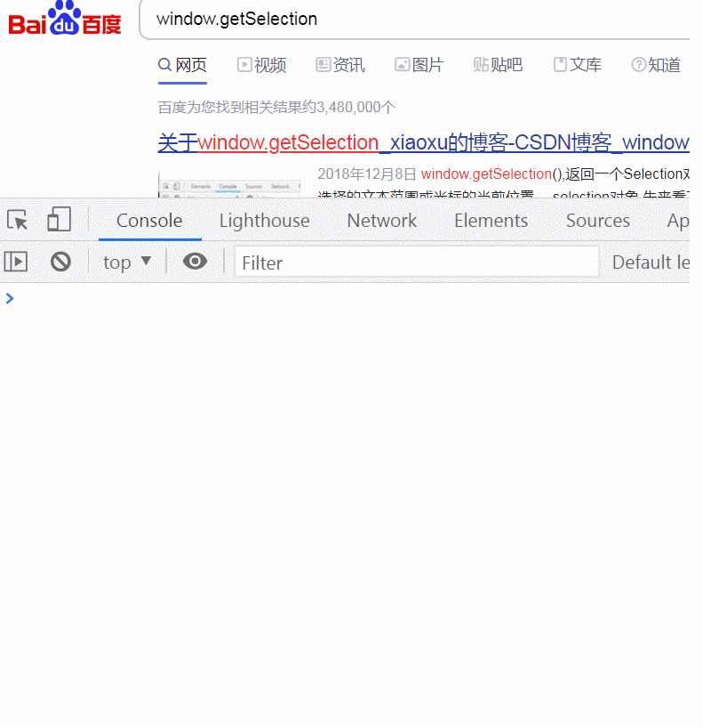
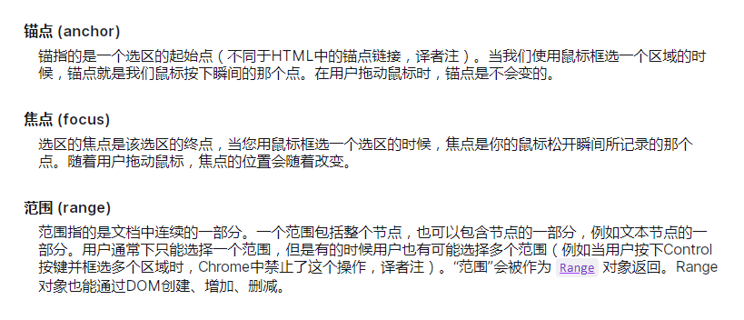
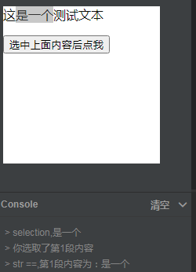
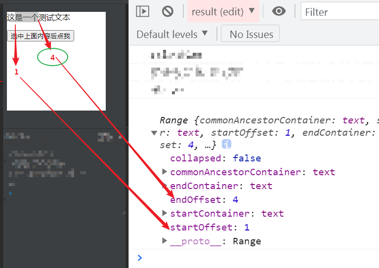
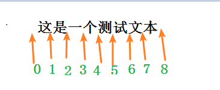

## 六期模块--计算公式功能点梳理

1、src/views/standardRuleMaintain下的 divEditable.vue

> 可编辑的div, 设置属性是**contenteditable**，就可以让其展示为输入框的效果

2、计算公式维护这边主要涉及了几个问题（重点问题加粗标出了）

 * **如何确定当前的光标位置，可以支持键盘输入@显示，也支持选择后插入**？
 * **选择的是变量，如何显示为蓝色，且光标不可定位在其中** ？
 * **如何与后台交互这部分数据，并回显数据** ？
 * 如何输入@后显示配置的下拉列表，并且支持模糊搜索？
 * 如何回车后也支持上述功能实现（之前是不支持的...）?


知识点涉及:
* window.getSelection()及其方法
* 正则匹配及替换

那么下面我们就针对以上的5个问题，一一做一个分析。


### 什么是selection, 里面包含什么？

 selection相关知识点: [MDN selection](https://developer.mozilla.org/zh-CN/docs/Web/API/Selection)

 window.getSelection() 方法表示用户选择的文本范围或光标的当前位置。

 动图了解：
 


重点了解这么几个知识：



用户可能从左到右（与文档方向相同）选择文本或从右到左（与文档方向相反）选择文本，这样就会导致anchor和focus是不同的。

接下来讲讲range， 表示的是范围，指的是文档中连续的一部分。range的相关理解可以参考这篇文章，讲的很详细： [range 理解,需翻墙](!https://javascript.info/selection-range#range-selection-methods)

getRangeAt方法有一个参数index，代表该Range对象的序列号；

`var range = document.getSelection().getRangeAt(index);`


我们可以通过Selection对象的rangeCount参数的值判断用户是否选取了内容；
* 当用户没有按下鼠标时候，该参数的值为0.
* 当用户按下鼠标的时候，该参数值为1.
* 当用户使用鼠标同时按住ctrl键时选取了一个或者多个区域时候，该参数值代表用户选取区域的数量。
* 当用户取消区域的选取时，该属性值为1，代表页面上存在一个空的Range对象；

我们下面写个例子：

```html
<div style="background-color: white;color: #111; height: 200px;width: 200px">
	<p>这是一个测试文本</p>
    <button onclick="getSelect()">选中上面内容后点我</button>
</div>
```

```js
function getSelect() {
 const sel = window.getSelection();
 console.log('selection', sel.toString())

 console.log(`你选取了第${sel.rangeCount}段内容`)
 const range = sel.getRangeAt(0);
 let str = "第" + (sel.rangeCount) + "段内容为：" + range
 console.log('str ==', str)
}
```

最终展示效果：




range的创建可以用3种方法：

* 可以用 Document 对象的 Document.createRange 方法创建 Range，此时这个range是空的
* 也可以用 Selection 对象的 getRangeAt 方法获取 Range
* 还可以通过 Document 对象的构造函数 Range() 来得到 Range。

（1） 属性，以下属性均为只读。

| 属性        | 释义    |
| --------   | -----:   
| startContainer| 返回包含 Range 开始的节点|
| endContainer | 返回包含 Range 终点的节点|
| startOffset        |返回一个表示 Range 起点在 startContainer 中的位置的数字，（1）如果startContainer是文本节点、注释节点或CDATA节点，则返回“起点”在startContainer中字符偏移量。（2）如果startContainer是元素节点，则返回“起点”在startContainer.childNodes中的次序 |
| endOffset |返回一个表示 Range 终点在 endContainer 中的位置的数字，**如果Range的父节点是Text类型的Node，则*偏移索引将是Range结束字符的索引*。对于其他Node类型，endOffset是子节点在父节点末尾的索引** |
| collapsed | 表示 Range 的起始位置和终止位置是否相同， true : 相同， false: 不同 |
| commonAncestorContainer | 返回完整包含 startContainer 和 endContainer 的、最深一级的节点|

前面得到例子里，我们打印以下获取到的range对象里：

<font color=red>注意endOffset的值：因为该节点是textNode，所以这里是第4个字符，索引是4！</font>



理解为：



（2）方法：

| 方法        | 释义    | 参数
| --------   | -----:  | ------:|
| setStart(startNode, startOffset)| 设置 Range 的起点| startNode:startContainer的引用,偏移则是startOffset|
| setEnd(endNode, endOffset) | 设置 Range 的终点|endNode: 设定 Range的结束位置; endOffset: 必须为不小于0的整数。表示从endNode的结束位置算起的偏移量。
| setStartBefore(referenceNode) | 将起点设置在referenceNode前 |
| setStartAfter(referenceNode) | 将起点设置在referenceNode后 |
| setEndBefore(referenceNode) | 将结束点设置在referenceNode前 |
| setEndAfter(referenceNode) | 将结束点设置在referenceNode后 |


<font color=red>注意:setStartBefore、setStartAfter、setEndBefore、setEndAfter方法设置的“起点”或“结束点”的父节点与referenceNode的父节点是同一个元素</font>


