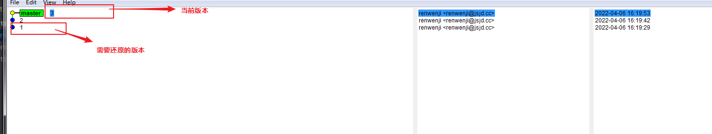
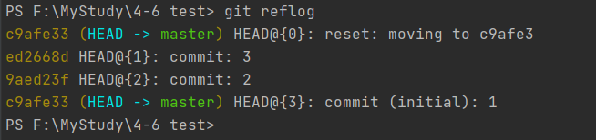
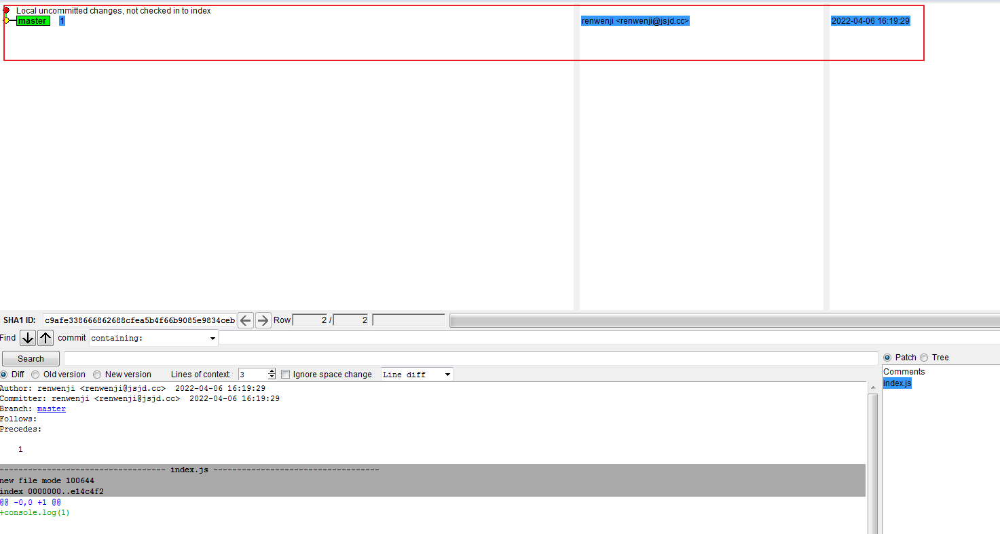
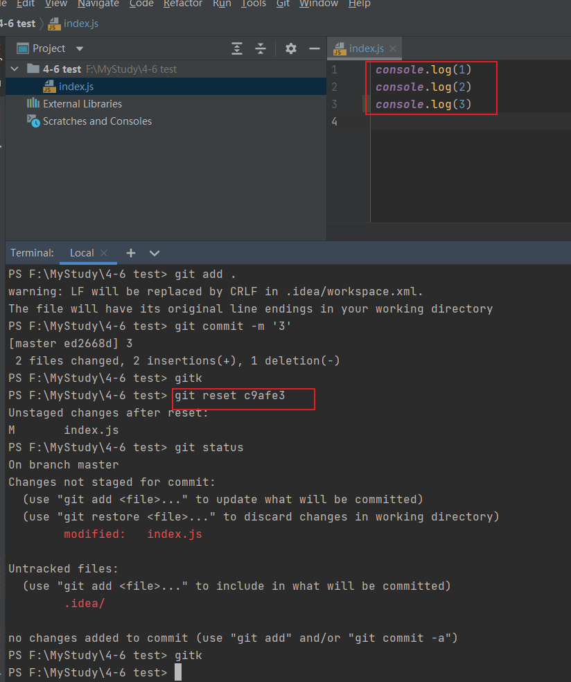
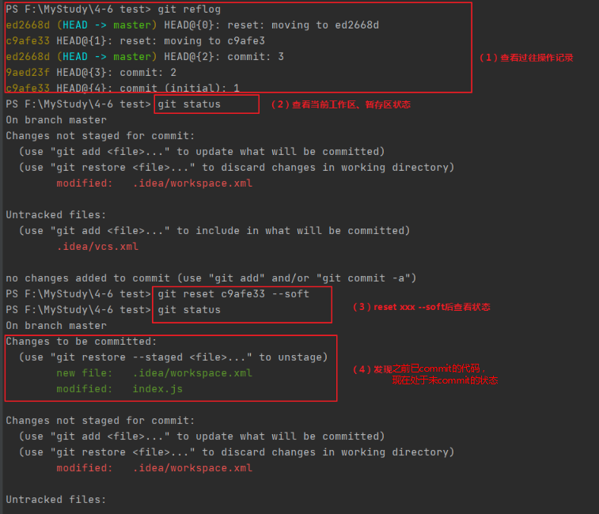
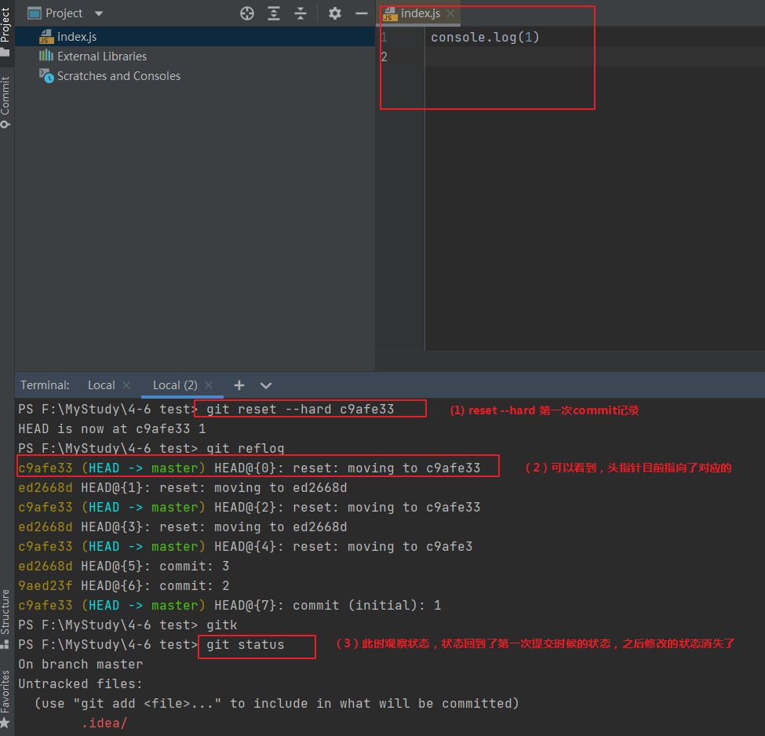
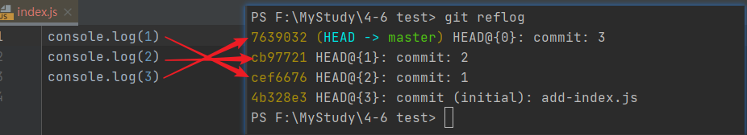
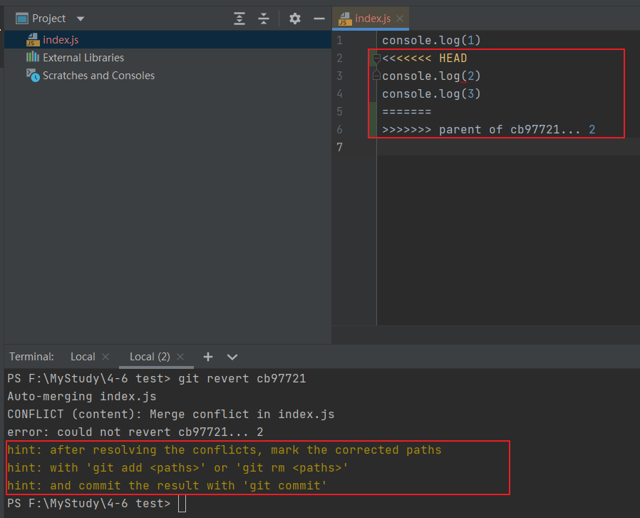
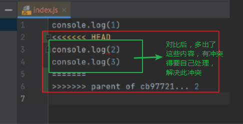
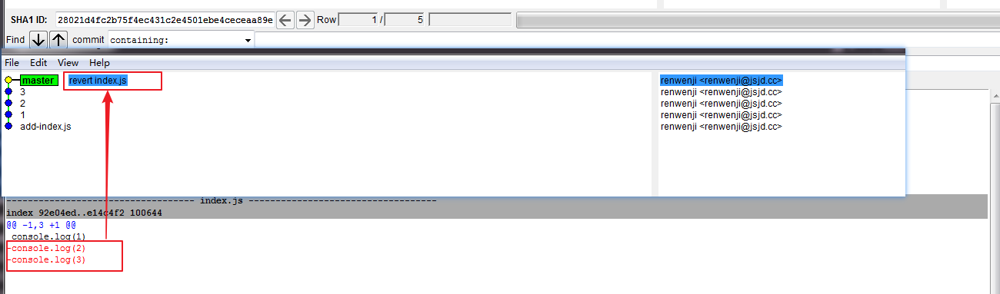

### git revert VS git reset

> 日常工作中，我们会十分频繁的用到git相关命令，git可以说是我们工作的一部分，合理正确的使用好git,对我们十分有帮助

先看下git 的三大区（工作区、暂存区、版本库）：

1. 工作区 working directory

   此时文件处于 untracked（未追踪） 状态，此时使用git add命令可将文件加入到暂存区

2. 暂存区 staging area

此时文件处于 unstaged 状态，此时使用commit 命令将文件提交到版本库

3. 版本库 repositoty

这里提供一个学习的链接：[git学习地址](https://learngitbranching.js.org/?locale=zh_CN)，学习内容会让你更丰富的理解git相关知识。

还有个图片，可以帮助大家记忆：


在这里我要提到的是git revert和git reset。

先开始总结一下异同点：

**相同点：** 都可以恢复某次提交的记录

**不同点：**

```git revert```

* 这个命令创建一个新的提交,撤销之前的某次或者连续、不连续的提交；
* 会在git提交历史中添加新的记录(不修改现有历史)；
* 头指针往最新的走

```git reset```
* 微微有些复杂的一个命令，有好些可以带的参数。
* 是针对于暂存区处理，会修改当前头指针指向
* 会改变现有的历史提交记录

字面意思理解一下二者的区别：
* reset 是重置的意思，revert 是恢复、还原的意思，作为 Coder ，第一感觉 reset 的效果比 revert 更猛一些，实际情况也的确如此，

----------------------------

那我们经常会碰到的场景是这样的：

>比如我们前端已经联调测试好需求代码了，提交上去了。后面也有几次新的提交。 但此时来了个新的bug修复紧急要上线，并且要求之前测好提交的那部分功能暂时先不上，这时候我们该怎么办？

模拟一下场景，我们已经提交了好几次，当前的HEAD指针指向最新的commit如下：



注意：上述这个界面，在window的环境下，可以输入```gitk```查看所有的提交列表信息，比git log直观很多，当然也可以通过这个命令： ```gitk xxxx(具体某个文件)```，显示出来某个文件的一系列提交记录

此时来了新的bug改动，相当于我们要在提交的1的基础上进行改动，进行新的提交，后面提交的内容还需要，只是暂时不用，怎么办呢？

使用```git reflog``` 先查看所有的提交记录了（类似于数据库保存了所有的提交的操作记录）



#### 先试试git reset会出现什么结果？

1、先输入 ```git reset c9afe3```,用于回退到提交记录1，重做一次新的操作
此时现象是：后面2次提交的记录都没了（其实提交的内容还在，只是我们看不到了）,HEAD指针指向了第一次提交记录,保留最新的暂存区的内容（2,3之前commit过了，所以内容还在）





这里提一嘴：

git reset 常用命令有三个分别是 soft, hard, mixed，这里相当于是 git reset --mixed c9afe3。关于这3者的区别如下：

1. ```git reset --soft```

移动HEAD到指定的 commit 节点，但**保留 工作区和暂存区的内容**，简单来说就是你的代码还在只是变成了未提交状态或未添加状态

2. ```git reset --hard```

彻底丢掉当前版本的修改，并更改HEAD移动到指定的commit节点；就是回退到指定的版本。**<font color=red size=3>不保留本地任何修改（危险！！）</font>**

3. ```git reset --mixed (默认的)```

--mixed是reset的默认参数，也就是当你不指定任何参数时的参数使用的。

它**只会保留暂存区的内容**，然后将HEAD移动到指定的commit节点。


我们再次回退到之前最新的commit记录,输入 `git reset ed2668d`。接下来，我们试下reset后面加上soft参数


#### 试试git reset后面加上soft参数变化



我们再次回退到之前最新的commit记录,输入 `git reset ed2668d`。接下来，我们试下reset后面加上hard参数

#### 试试git reset后面加上hard参数变化




所以对于之前我们说的问题：**此时来了新的bug改动，相当于我们要在提交的1的基础上进行改动，进行新的提交**，可以使用安全的命令实现

```git reset c9afe3(这个提交id为需要在之前提交的某个基础上改动的id)```


#### git revert会出现什么结果？

这里要普及一下revert命令的知识：

git revert 撤销某次操作，此次操作之前和之后的commit和history都会保留，并且把这次撤销，作为一次最新的提交，
可以单个撤销，也可以连续撤销，亦可以不连续撤销，命令如下

```js
git revert HEAD                  //撤销前一次 commit
git revert HEAD^               //撤销前前一次 commit    
git revert commit_id //（比如:fa042ce57ebbe5bb9c8db709f719cec2c58ee7ff）
```

连续：

```js
git revert -n commit_id_start..commit_id_end
```

不连续：

```js
git revert -n commit_id_1
git revert -n commit_id_3
//使用该命令可以撤回到commit_id_1和commit_id_3的提交
```

我们重新建个index.js, 提交3次，形成如下的记录：



我们试下命令  ```git revert cb97721```,想要撤销2的改动，3保留，即在1的基础上添加新的改动。即原来是

1--->2 ---->3

希望变成：

1--->3，然后再继续接下来的改动

(ÒωÓױ)！？输入命令后，控制台竟然有冲突？？



查阅一番得知，这样的出现是正确的，因为对于我们的第1、2、3次提交，都针对的是同一个index.js文件。对于我们上述输的命令，

```git revert cb97721```

它要**撤销第二次的提交**，即相当于第二次提交的内容没有，**显示第一次提交的内容**，而第一次index.js里面的内容是什么呢？

```js
console.log(1)
```

而现在的内容是：
```js
console.log(1)
console.log(2)
console.log(3)
```

所以，多出了中间绿色圈出来的这部分内容：



我们可以依据项目实际内容做抉择后，比如这里我就想恢复到提交1那时候的状态，所以解决冲突后,

```js
# modify and save file
git add .
git revert --continue
```

一顿操作后，再次查看，可以看到发生了变化



或者对于我们提到的情况，可以不使用上述命令，reset或者revert, 使用checkout命令，这里有个checkout链接学习：[git checkout 用法](https://blog.csdn.net/longintchar/article/details/82953474)

我们使用里面 checkout 的第一种用法,用于拿暂存区的文件覆盖工作区的文件，或者用指定提交中的文件覆盖暂存区和工作区中对应的文件。

```js
git checkout [<commit>] [--] <paths>
```

所以对于我们的情景，应该写出的语句是:

```js
git checkout cef6676 index.js
git commit -m "Reverted to 提交1的记录"
```

即可以解决我们的问题。

> PS: 如果我们过了一段时间之后，还需要之前 暂时不见的 改动的内容该怎么办呢？留个思考题，我们下次接着说。

git的神奇魔法很多，很多知识我们在实际运用中还得好好学习


