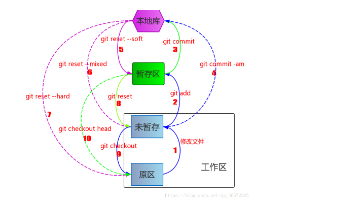

### git revert VS git reset

> 日常工作中，我们会十分频繁的用到git相关命令，git可以说是我们工作的一部分，合理正确的使用好git,对我们十分有帮助

这里提供一个学习的链接：[git学习地址](https://learngitbranching.js.org/?locale=zh_CN)

学习内容会让你更丰富的理解git相关知识。

先看下git 的三大区（工作区、暂存区、版本库）：

1. 工作区 working directory

   此时文件处于 untracked（未追踪） 状态，此时使用git add命令可将文件加入到暂存区

2. 暂存区 staging area

此时文件处于 unstaged 状态，此时使用commit 命令将文件提交到版本库

3. 版本库 repositoty



在这里我要提到的是git revert和git reset，

字面意思理解一下二者的区别：
* reset 是重置的意思，revert 是恢复、还原的意思，作为 Coder ，第一感觉 reset 的效果比 revert 更猛一些，实际情况也的确如此，

那我们经常会碰到的场景是这样的：

* 比如我们前端已经联调测试好需求代码了，提交上去了。但此时来了个新的bug修复紧急要上线，并且要求新的功能暂时先不上，这时候我们该怎么办？

模拟一下场景，我们已经提交了好几次，当前的HEAD指针指向最新的commit如下：


注意：上述这个界面，在window的环境下，可以输入```gitk```查看所有的提交列表信息，比git log直观很多，当然也可以通过这个命令： ```gitk xxxx(具体某个文件)```，显示出来某个文件的一系列提交记录

此时来了新的bug改动，相当于我们要在提交的1的基础上进行改动，进行新的提交，之后的内容都不需要

#### 先试试git reset会出现什么结果？

1、先输入 ```git reset c9afe3```,用于回退到提交记录1，重做一次新的操作
此时现象是：后面2次提交的记录都没了（其实提交的内容还在，只是我们看不到了）,HEAD指针指向了第一次提交记录,并且回到本地编辑的状态


这里提一嘴：

git reset 常用命令有三个分别是 soft, hard, mixed，这里相当于是 git reset --mixed c9afe3。关于这3者的区别如下：

1. ```git reset --soft```

移动HEAD到指定的 commit 节点，但保留 工作区和暂存区的内容，简单来说就是你的代码还在只是变成了未提交状态或未添加状态

2. ```git reset --hard```

彻底丢掉当前版本的修改，并更改HEAD移动到指定的commit节点；就是回退到指定的版本。不保留本地任何修改

3. ```git reset --mixed (默认的)```

-mixed是reset的默认参数，也就是当你不指定任何参数时的参数使用的。

它会只会保留暂存区的内容，然后将HEAD移动到指定的commit节点。

我们使用```git reflog``` 就能看到所有的提交记录了（类似于数据库保存了所有的提交的操作记录）


我们再次回退到之前最新的commit记录,输入 git reset ed2668d。接下来，我们试下reset后面加上soft参数


#### 试试git reset后面加上soft参数变化


我们再次回退到之前最新的commit记录,输入 git reset ed2668d。接下来，我们试下reset后面加上hard参数

#### 试试git reset后面加上hard参数变化


