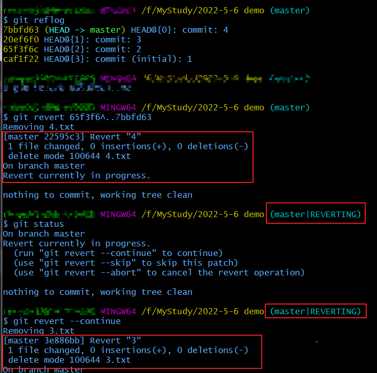
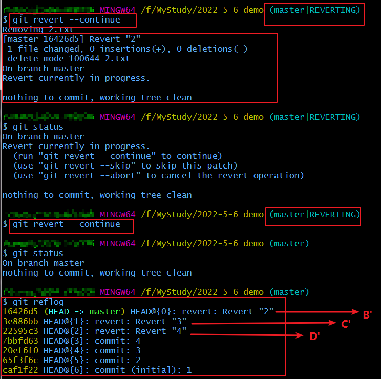
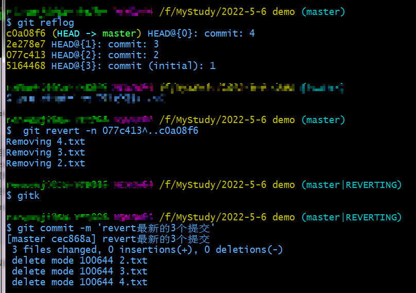
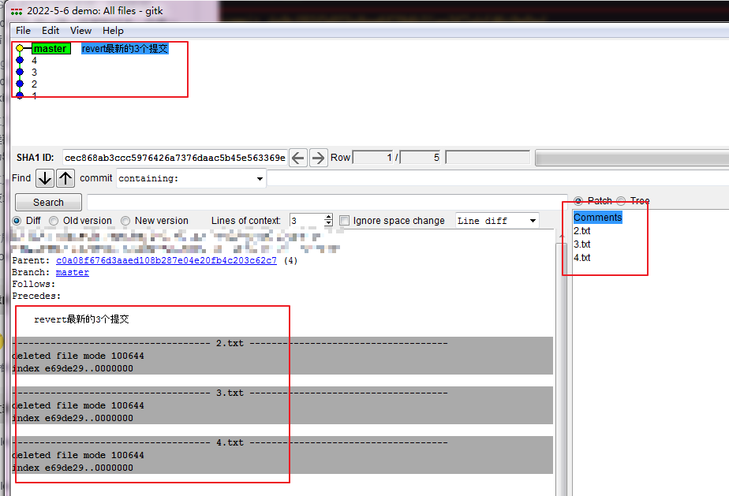

# git revert多个commit 记录

参考文章： [git revert多个提交](!https://blog.csdn.net/zhangxiaoyang0/article/details/90213597)

现在有提交如下：

`
A -> B -> C -> D
`

如果想把B，C，D都给revert，

* 可以以选择一个一个revert之外，形如以下命令：

`git revert --no-commit D`

`git revert --no-commit C`

`git revert --no-commit B`

此时我们的状态就回到了提交记录A的状态，再进行提交形成revert提交记录

`git commit -m "reverted of B、C、D"`

此时分支状态变为：

`
A -> B -> C -> D -> D' -> C' -> B'
`

还可以使用revert一个范围， 使用`git revert OLDER_COMMIT^..NEWER_COMMIT`

注意：是较早提交的commit在前面，最新的commit在后面

`
git revert -n B^..D
`

* 上述-n 是表示 --no-commit的简写，代表不自动提交，只是将回滚的代码添加到暂存区
* 因为revert是回滚一个版本，如果不加-n 自动提交，会形成多个revert记录，如图1-2,此时状态变为：

`
A -> B -> C -> D -> D' -> C' -> B'
`

图1：

图2：

* 加上-n 后，可以自己手动commit提交的信息，成为一条综合的revert后的提交信息。
比如此次撤销B、C、D的改动，提交commit后再查看，合并为一条提交记录，如图3-4
* B^ 意味着“B”的第一个父提交：允许包括B在内的进行revert撤销

图3：

图4：

这样就把B、C、D都revert了，变成如下的提交，此时分支状态变为

`
A -> B -> C -> D ->E'
`

<Valine />
