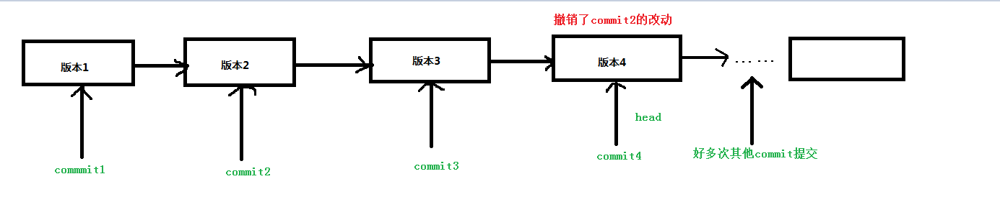
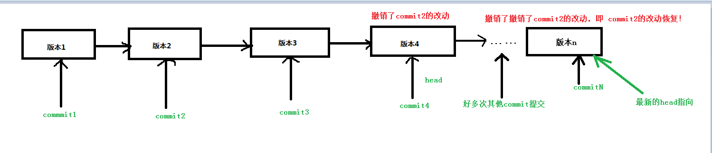

### git revert之恢复之前撤销的记录

前面我们比较了git revert和git reset用来代码回退，在最后提到了，

>  如果我们过了一段时间之后，还需要之前 暂时不见的 改动的内容该怎么办呢？

假设我们现在只有一个主master分支，按照之前的做法会是这样的：

现在我们在版本3的时候执行git revert操作，convert掉commit2的操作，然后进入新的版本4，这时候commit2的提交被revert掉，头指针指向了commit4, 如下：

然后后面我们因为项目开发，又提交迭代了很多新的记录。某天时又说，把之前撤销的commit2版本内容恢复？

这时候正确的做法是：找到之前revert commit2的提交。即commit 4的hash提交id值，把commit4的提交重新revert掉，这时候，我们所需要的之前commit2的内容就回来了。

理解：

* commit4  =  撤销了commit2的改动提交

* 新的commmitN = 撤销了commit4的改动提交

综合起来就是： 新的commmitN = 撤销了commit4的改动提交 = **撤销了** 撤销了commit2的改动提交

还记得我们语文学到的双重否定表示肯定 吗？所以这里相当于 **commitN = commit2的改动提交** ，这样我们就得到了恢复的版本！

图示理解：

