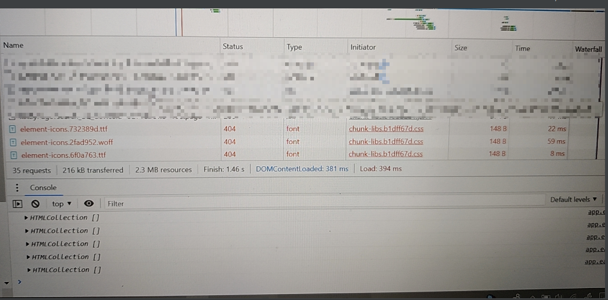
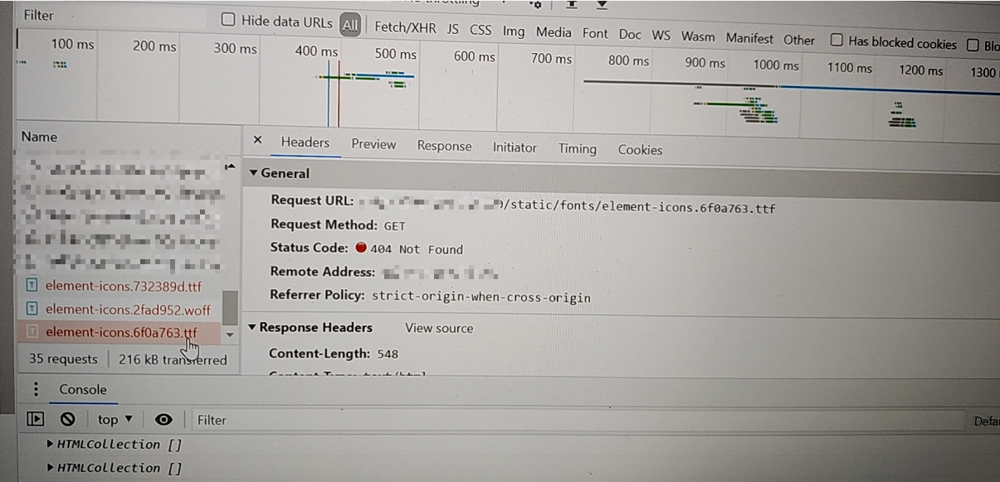
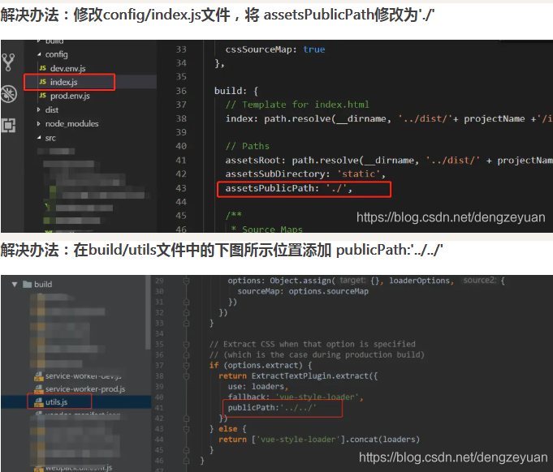
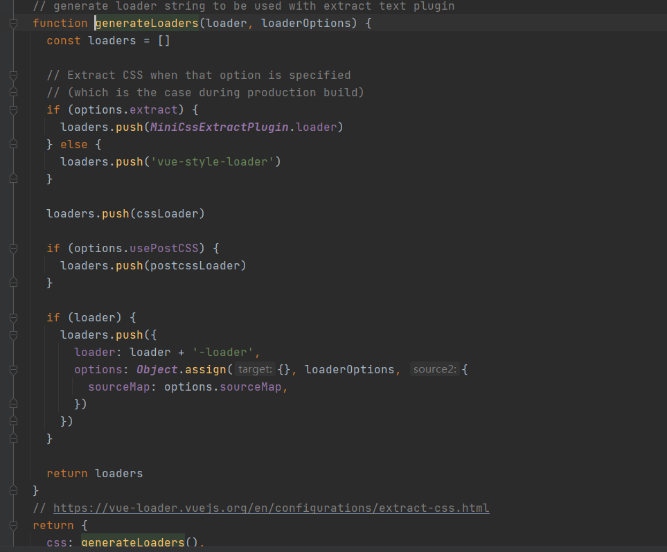
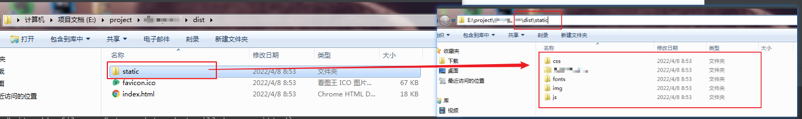
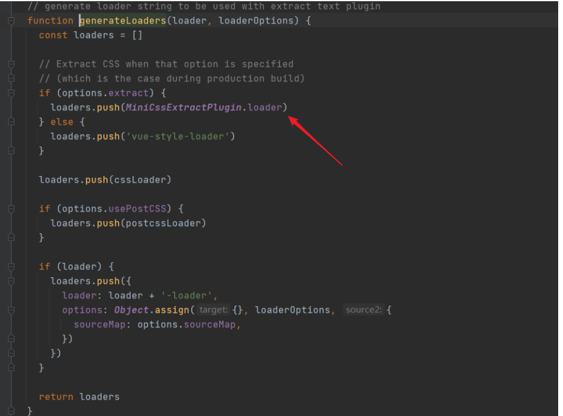
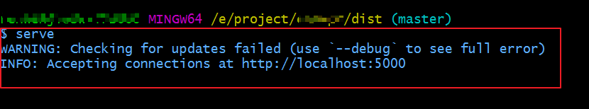
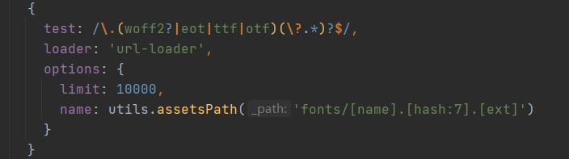

### vue打包 element-icons.woff 和element-icons.ttf 字体文件路径错误，导致icon图标显示不见的问题。

之前项目中，碰到过几次，都是没改项目配置。然后打包完成部署后发现，element fonts字体丢失了。就像下面这样：



查看network后，发现fonts的路径不对，static下并无fonts文件，或者有些时候，会变成static/css/static/fonts/这样。而去服务器查找一番，发现路径并不对，才导致访问失败



查阅百度。。答案千篇一律，都是这样的，并不能解决我的问题：



而我的 build/utils下的generateLoaders()长这样。。



正常情况下，前端项目打包，最终生成的dist文件包含内容应该如下：




那咋办。费了一番功夫，终于有解决办法了，这里有2个解决办法：
参考了这篇文章，[链接1](https://blog.csdn.net/u013299635/article/details/106523649)

希望能帮到你。

##### 第一个：
解决方法如下，修改红色箭头指出的地方，



改动代码如下：

```js
if (options.extract) {
    loaders.push({
        loader: MiniCssExtractPlugin.loader,
        options: {
            publicPath: '../../'
        }
    })
} else {
    loaders.push('vue-style-loader')
}
```

这样重新打包后就好了，路径恢复正常。

有个问题是，一般前端项目代码打包好之后，直接打开index.html文件是无法运行和浏览的，除非将打包好的代码部署到服务器上，那前端如何查看打包好的文件呢？也方便我们调试查看问题，比如这个fonts路径问题，

参考链接这个：[浏览打包好的文件：npm包serve的使用](https://blog.csdn.net/kiyoometal/article/details/106860510)。敲几个命令，成功后，在项目dist文件夹下，输入 `serve` 就可以看到效果了




#### 第二个：

常规的webpack.base.conf.js里面关于字体文件的配置如下所示：



我们改写一下形式，并使用file-loader来加载（这里

- file-loader和url-loader的异同点，等到下一篇文章再做总结

- 其实还要总结一篇绝对路径、相对路径的，总是搞不清楚。。
）

```js
{
        test: /\.(woff2?|eot|ttf|otf)(\?.*)?$/,
        use: {
          loader: 'file-loader',
          options: {
            name: 'fonts/[name].[hash:7].[ext]',
            outputPath: 'static/',
            publicPath: '../../static/'
          },
        },
 }
```

好了，以上问题就解决啦。

<Valine />


